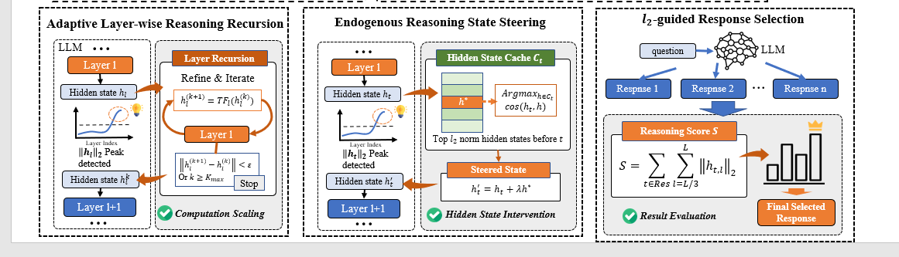

# The Tell-Tale Norm: ℓ² Magnitude as a Signal for Reasoning Dynamics in Large Language Models

[](LICENSE)

> **Reasoning leaves a trace. We found it in the ℓ² norm.**

This repository contains the official implementation of **"The Tell-Tale Norm"**, a novel framework that reveals how large language models (LLMs) internally perform reasoning—and how to control it at test time, **without any training or external data**.

We demonstrate that the **ℓ² norm of hidden states** is a robust, intrinsic signal of reasoning intensity. Building on this insight, we introduce three plug-and-play techniques that significantly boost reasoning performance across diverse models and benchmarks—**by an average of 8.33%**.



## 🚀 Key Features

- **Training-Free & Data-Free**: No fine-tuning, no extra data, no SAEs required.
- **vLLM-Compatible**: Fully integrated with [vLLM](https://github.com/vllm-project/vllm) for high-throughput inference.
- **Universal**: Works across model families (Qwen, LLaMA, etc.) and reasoning tasks (math, logic, knowledge).
- **Three Powerful Techniques**:
  1. **Adaptive Layer-wise Reasoning Recursion (ALRR)**: Dynamically recompute high-reasoning layers.
  2. **Endogenous Reasoning State Steering (ERSS)**: Inject historical high-norm states to amplify reasoning.
  3. **ℓ²-guided Response Selection (LRS)**: Select the best output based on internal reasoning intensity.


## 📦 Repository Structure

```
.
├── environment.yml          # Conda environment for reproducibility
├── overview.png             # Main figure from the paper
├── vllm_patches/            # vLLM-compatible patches for all three methods
│   ├── loop/                # ALRR: Adaptive Layer-wise Reasoning Recursion
│   ├── suppress/            # Ablation: High-norm suppression
│   ├── ttts/                # ERSS: Endogenous Reasoning State Steering
│   └── rerank/              # LRS: ℓ²-guided Response Selection
└── lm_eval_adapters/        # Adapters for lm-evaluation-harness
    └── vllm_loop.py         # Example: integrate ALRR into evaluation
```

## ⚡ Quick Start

### 1. Set up the environment
```
conda env create -f environment.yml
conda activate telltale-norm
```

### 2. Run evaluation with ℓ²-guided recursion
```
VLLM_PATCH=loop \
PATCHED_LAYERS="21,22,23,24,25,26" \
PATCHED_TAU_JSON='{"21":1300,"22":1550,"23":1850,"24":2300,"25":2800,"26":3600}' \
python -m lm_eval --model vllm --model_args pretrained=your/model/path \
                  --tasks gsm8k,aime24 --batch_size auto
```

> Replace `your/model/path` with your local or Hugging Face model path.

### 3. Try other methods
- For **Response Selection (LRS)**: set `VLLM_PATCH=rerank`
- For **State Steering (ERSS)**: set `VLLM_PATCH=ttts`

All methods are controlled via environment variables—no code changes needed!

## 🤝 How It Works

1. **Detect**: During decoding, compute ℓ² norms of hidden states in late layers.
2. **Adapt**: Use adaptive thresholds (IQR-based) to identify "reasoning peaks".
3. **Intervene**: Apply one of our three strategies to amplify or select based on these peaks.

Because the ℓ² norm is **intrinsic** to the model’s latent geometry, our approach is:
- **General**: No per-model SAE training.
- **Efficient**: Adds minimal overhead (<5% latency).
- **Effective**: Works even on small models (e.g., Qwen3-1.7B).


## 📜 Citation

If you find this work useful, please cite our paper:

bibtex
@article{anonymous2026telltalenorm,
  title={The Tell-Tale Norm: ℓ² Magnitude as a Signal for Reasoning Dynamics in Large Language Models},
  author={Anonymous Authors},
  journal={International Conference on Machine Learning (ICML) Submission},
  year={2026}
}

## 🛠️ Disclaimer

This is a **preliminary work under review**. All model names, architectures, and results are reported anonymously to comply with double-blind review policies.

For questions, please open an issue!